[[rest-list-parameter]]
= REST-List Parameter Plugin
:toc: macro
:toc-title:

image:https://ci.jenkins.io/job/Plugins/job/rest-list-parameter-plugin/job/main/badge/icon[link="https://ci.jenkins.io/job/Plugins/job/rest-list-parameter-plugin/job/main/"]
image:https://img.shields.io/codefactor/grade/github/jenkinsci/rest-list-parameter-plugin/main.svg[CodeFactor Grade,link="https://www.codefactor.io/repository/github/jenkinsci/rest-list-parameter-plugin"]
image:https://img.shields.io/github/license/jenkinsci/rest-list-parameter-plugin.svg?color=green[link="https://github.com/jenkinsci/rest-list-parameter-plugin/blob/main/LICENSE"]
image:https://img.shields.io/maintenance/yes/2024.svg[link="https://github.com/jenkinsci/rest-list-parameter-plugin"]
image:https://img.shields.io/badge/contributions-welcome-green.svg[link="https://github.com/jenkinsci/rest-list-parameter-plugin#contributing"] +
image:https://img.shields.io/github/contributors/jenkinsci/rest-list-parameter-plugin.svg?color=blue[link="https://github.com/jenkinsci/rest-list-parameter-plugin/graphs/contributors"]
image:https://img.shields.io/jenkins/plugin/i/rest-list-parameter.svg?color=blue&label=installations[link="https://plugins.jenkins.io/rest-list-parameter"]
image:https://img.shields.io/github/release/jenkinsci/rest-list-parameter-plugin.svg?label=changelog[link="https://github.com/jenkinsci/rest-list-parameter-plugin/releases/latest"]

[#introduction]
== Introduction

This Plugin provides parameter type that can request a REST endpoint and offer a list of values parsed from the response value at build start time.
The REST responses may contain Json or XML, which can be parsed with link:https://restfulapi.net/json-jsonpath/[Json-Path] and link:https://www.w3schools.com/xml/xpath_syntax.asp[xPath] respectively.
If the REST endpoint requires authentication, then either Basic or Bearer authentication can be used.

toc::[]

[#changelog]
== Changelog

Release notes can be found in the link:https://github.com/jenkinsci/rest-list-parameter-plugin/releases[GitHub Releases]

[#features]
== Features

* Specify any REST/Web endpoint that returns either a Json or XML response with values to select from for a build
* Authenticate against the endpoint if required (either with `BASIC` or `BEARER` authentication)
* Add custom HTTP headers to REST requests
* Follow paginated REST APIs (`Link` header or continuation token) to offer values beyond the first page
* Filter/Pars the values of the web response with Json-Path or xPath (depending on MIME type)
* Set a per-selected default value (as long as that value is within the received value list)
* Pick several values in one build with the link:#multi-list-parameter[REST Multi List Parameter]
* Values load in the background after the `Build with Parameters` page opens, each parameter on its own, with a refresh action
* User-friendly error communication, with request details for users who can configure the job
* Value caching independent of the endpoint's caching headers, with a bounded fetch time
* Advanced configuration validation
* Optional value post processing
** Filter the already parsed values via a REGEX
** Apply a sort order to the values

[#configuration]
== Configuration

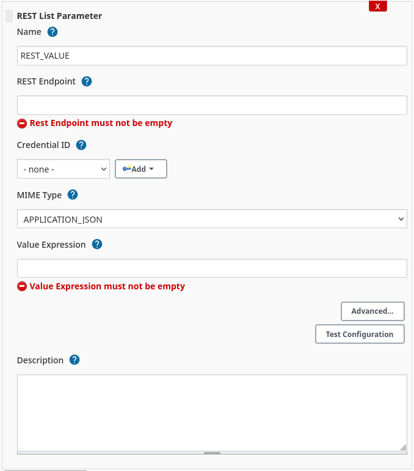

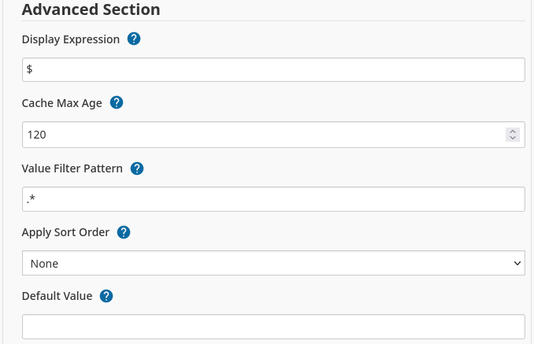

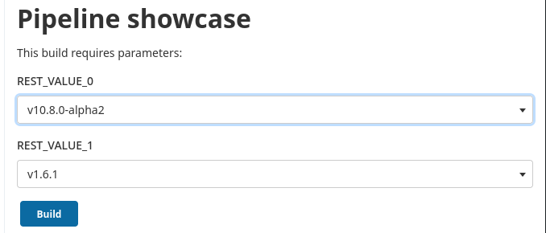

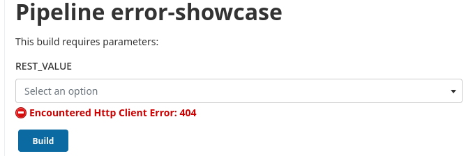

[#jsonPath-configuration]
=== Json-Path configuration

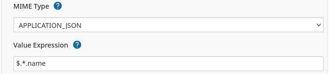

If you expect the response of the specified endpoint to produce a Json response and need to utilize Json-Path, then you have to set the MIME type to _APPLICATION_JSON_ (this will also send this MIME as `ACCEPT` header) and provide the desired Json-Path in the _Value Expression_ field.

The result of such a configuration will be the application of the Json-Path on the response Json to pars the string values later provided in the _Build with Parameter_ dropdown of this parameter.

==== Display value configuration

NOTE: Added in v1.5.x thanks to `rolaca11`

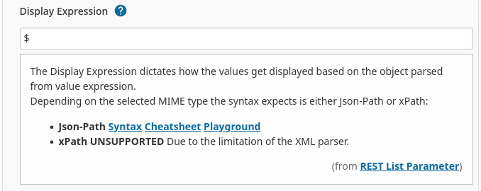

The optional 'display value' configuration, hidden within the advanced configuration, allows the use of a REST service that returns full Json objects that get pased into the Pipeline run but to display only an identifying value within the select dropdown.

.Example JSON returned by REST endpoint
[source,json]
----
[
  {
    "name": "v10.7.7",
    "zipball_url": "https://api.github.com/repos/jellyfin/jellyfin/zipball/v10.7.7",
    "tarball_url": "https://api.github.com/repos/jellyfin/jellyfin/tarball/v10.7.7",
    "commit": {
      "sha": "53186c766bddf954483d7b40e385b382eabd0d8e",
      "url": "https://api.github.com/repos/jellyfin/jellyfin/commits/53186c766bddf954483d7b40e385b382eabd0d8e"
    },
    "node_id": "MDM6UmVmMTYxMDEyMDE5OnJlZnMvdGFncy92MTAuNi40"
  },
  {
    "...": "..."
  }
]
----

With a `Value Expression` such as `$.*` and a `Display Expression` such as `$.name` the values in the dropdown would only show up as the name property of each JSON object (i.e. `v10.7.7`).

[#xPath-configuration]
=== xPath configuration

IMPORTANT: If you are a user of this functionality please have a look at the pined issue #99

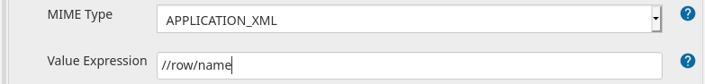

If you expect the response of the specified endpoint to produce an XML response and need to utilize xPath, then you have to set the MIME type to _APPLICATION_XML_ (this will also send this MIME as `ACCEPT` header) and provide the desired xPath in the _Value Expression_ field.

The result of such a configuration will be the application of the xPath on the response XML to pars the string values later provided in the _Build with Parameter_ dropdown of this parameter.

[#auth-configuration]
=== Authentication configuration

Depending on the authentication requirement for the REST/Web endpoint there are three supported methods:

* `NONE` if there is no authentication requirement simply don't select any _Credential ID_
* `BASIC` if this authentication type is required, then simply select any Username and Password credential in the _Credential ID_ field
* `BEARER` if this authentication type is required, then simply select any Secret Text credential in the _Credential ID_ field

IMPORTANT: The Authentication header will be build and added based on the type of the selected credential type.

[#custom-headers]
=== Custom HTTP headers

Custom HTTP headers can be added from the parameter's advanced configuration.
This is useful for APIs that require headers such as `X-API-Key`, `X-Auth-Token`, or a custom `Authorization` format that is not covered by the built-in Basic or Bearer authentication support.

Each custom header entry supports:

* `Header name` - for example `X-API-Key`, `X-Auth-Token`, or `Authorization`
* `Static value` - stored by Jenkins as a `Secret`
* `Secret Text credential` - recommended for API keys, tokens, and other sensitive values
* `Value prefix` - optional text prepended to the static value or credential value, for example `Token `

For sensitive header values, create a Jenkins credential of type `Secret text` and select it in the custom header row.
This keeps tokens out of the job configuration and allows credentials to be rotated centrally.

.Examples
[cols="1,1,1"]
|===
|Header name |Credential / value |Resulting request header

|`X-API-Key`
|Secret Text credential `my-api-key`
|`X-API-Key: ****`

|`X-Auth-Token`
|Secret Text credential `my-auth-token`
|`X-Auth-Token: ****`

|`Authorization`
|Value prefix `CustomFormat ` plus Secret Text credential `custom-auth-token`
|`Authorization: CustomFormat ****`
|===

Custom headers are applied after the default `Accept` header and the optional authentication header from `Credential ID`.
If a custom `Authorization` header is configured, it overrides the default Basic or Bearer authentication header.

`Test Configuration` sends the custom headers exactly as a build would, including rows you have added or changed but not saved yet.
The `REST Endpoint` field check does not send custom headers.
If the endpoint rejects that check with 401 or 403, it shows a warning instead of an error; use `Test Configuration` to verify the headers.

[#pagination]
=== Pagination

Many APIs return their values in pages, for example GitHub (at most 100 items per page) or Nexus 3.
Without pagination, the parameter only offers the values of the first page.
Check `Follow paginated responses` in the parameter's advanced configuration and pick a strategy:

[cols="1,2,1"]
|===
|Strategy |How the next page is found |Used by

|`Link header` (`linkHeader`)
|The URL of the `Link` response header entry whose `rel` includes `next`. Relative URLs are resolved against the page that returned them. Works for Json and XML.
|GitHub, GitLab, Gitea, Harbor

|`Continuation token` (`continuationToken`)
|A token read from the Json body with the `Token Expression` (Json-Path). The `REST Endpoint` is requested again with the token as the `Query Parameter`. The endpoint's other query parameters are kept, and a parameter of the same name is replaced. Json only.
|Nexus 3, Bitbucket Server (`$.nextPageStart` as `start`)
|===

Pagination ends when a page has no next link, or when the token expression finds nothing, `null` or an empty string.

The `Value Expression` and `Display Expression` are applied to *each page on its own*, so write them for a single page (for Nexus 3, `$.items[*].version`, not an expression over all pages).
The entries of all pages are joined in page order, and the `Value Filter Pattern` and `Apply Sort Order` are then applied once to the combined list.
A page without matches is fine. Only when all pages together yield nothing is it reported as "no values" (subject to `Allow Empty Value`).

Page limit::
`Max Pages` limits the number of requests per fetch, counting the first one: 10 by default, at most 100 (larger values are treated as 100).
When the limit is reached while the last page still points to a next page, the values fetched so far are used and a warning is logged.
All pages are requested one after another when the parameter's values load, so each page adds to the time until they appear, and all of them together are bounded by the global link:#fetchTimeout[fetch timeout].
The combined values of all pages are cached as one list for the `Cache Max Age` (see link:#valueCaching[Value Caching]).

Same-host rule::
Every page is requested with the same credentials and custom headers as the first one.
To keep them from leaking, pagination only follows URLs with the same scheme, host and port as the `REST Endpoint`.
A next page on another host fails the fetch with `Next page is not on the same host as the Rest Endpoint: <origin>`, and no request is sent to it.

Failures and loops::
A failure on any page fails the whole list. For page 2 and later, the error names the page, for example `Encountered Http Server Error: 503 (page 4)`.
A next page that was already requested, or a repeated token, ends pagination with a warning and keeps the values fetched so far.

`Test Configuration` uses the form's pagination settings, including unsaved changes, and reports the pages fetched, for example `Test Successful! 57 Values from 3 pages, first: v1.0`.
When the page limit was reached, the result is a warning ending in `(page limit reached, more values may exist)`.

.GitHub tags (`Link` header)
[source,groovy]
----
RESTList(
  name: 'TAG',
  description: '',
  restEndpoint: 'https://api.github.com/repos/jenkinsci/jenkins/tags?per_page=100',
  credentialId: '',
  mimeType: 'APPLICATION_JSON',
  valueExpression: '$.*.name',
  pagination: linkHeader(maxPages: 5)
)
----

.Nexus 3 components (continuation token)
[source,groovy]
----
RESTList(
  name: 'VERSION',
  description: '',
  restEndpoint: 'https://nexus.example.com/service/rest/v1/components?repository=releases',
  credentialId: 'nexus-user',
  mimeType: 'APPLICATION_JSON',
  valueExpression: '$.items[*].version',
  pagination: continuationToken(tokenExpression: '$.continuationToken', queryParameter: 'continuationToken')
)
----

Omitting `pagination` keeps a single request per fetch. The same `pagination` property is available on the link:#multi-list-parameter[REST Multi List Parameter].

[#validation]
=== Parameter Config Validation

NOTE: Added in v1.1.0

The configuration page of this plugin features supportive form validation (which was already present in a basic form in v1.0.x).
With v1.1.x+ the validation got expanded to be more helpful and prevent the constant switch from the configuration to a build and back, just to validate the configuration.
The most notable expansion in validation was the `REST Endpoint` field validation, which now works similar to the validation found for the SCM fields (Endpoint and credential).
Additionally, a `Test Configuration` button got added, which once pressed, attempts to query the endpoint and list the number of parsed values as well as the first value in the list.

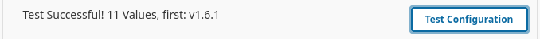

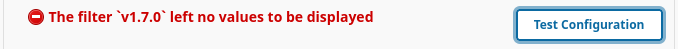

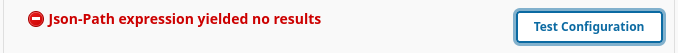

[#asyncLoading]
=== Loading values on the build form

The `Build with Parameters` page opens without waiting for any endpoint.
Each `REST List Parameter` and `REST Multi List Parameter` shows a loading indicator and requests its values on its own, so a slow endpoint only delays its own parameter.
Once the values arrive, the parameter shows them in its dropdown or multi-select, with the usual default preselection.

* While any parameter is still loading, the form is not submitted; clicking `Build` shows `Values are still loading` beneath the parameters still loading.
A parameter whose load failed does not block the form: the submitted value is validated as usual.
* A failed load shows its error beneath the parameter with a `Retry` action.
Users who can configure the job also see the endpoint URL (without query string and user info), the page that failed, the HTTP status or exception type and the duration; response bodies and secrets are never shown.
* The refresh button next to each parameter loads its values again, bypassing all caches.
The selected entry stays selected if it is still offered, and custom values picked with validation disabled are kept, in the dropdown as in a multi-select.
* With `Enable Value Validation` unchecked, a `REST List Parameter` also accepts a value that is not among the entries: type it into the dropdown's search field and pick `Use "<text>"`, and it is submitted verbatim.
* Loading the values requires the Build permission on the job.
In a Pipeline `input` step, users without Build on the job cannot load the values.
* The values are shown by JavaScript, as Select2 already required.

[#fetchTimeout]
Fetch timeout::
One fetch of a parameter's values, including all its pages, may take at most the global `Fetch Timeout` _(default 60 seconds)_.
When it is reached, the parameter shows `Fetching values timed out after <n> seconds` instead of values.

[#valueCaching]
=== Value Caching

NOTE: Added in v1.2.0; since the values load in the background, the processed values are cached independently of the endpoint's caching headers.

The ability to use value caching allows for great performance improvements in cases of repetitive building and querying the same REST endpoints.
Additionally, it drastically decreases the amount of endpoint queries, which is especially useful for rate limited endpoints.
Per default caching is disabled for new and old `REST List Parameter`, but can be activated at any time by setting how many minutes the values should stay cached for.

With a `Cache Max Age` greater than 0, the final values of a successful fetch (all pages, after the expressions, the filter and the order) are kept in memory for that many minutes.
This works whatever caching headers the endpoint sends, including `Cache-Control: no-store`.
The build form, the validation of a submitted value and Rebuild all use these values:

* Values are cached per job, parameter name and value source (endpoint, credentials, MIME type, expressions, filter, order, custom headers and pagination), so jobs with different credentials never share values, and changing the configuration makes earlier values unused.
* Failed fetches are not cached, and do not remove values cached earlier.
* A submitted value found in fresh cached values is accepted without contacting the endpoint.
Otherwise the values are fetched once more, bypassing all caches, before the value is accepted or rejected, so a value published after the values were cached (for example a release triggered by a Pipeline) is accepted.
* The cache holds the values of up to 1000 parameters, evicting the least recently used ones first (system property `io.jenkins.plugins.restlistparam.ValueCache.maxEntries`), is never written to disk, and is empty after Jenkins restarts.

Cached values are replaced with fresh ones by the refresh button on the build form, and administrators can clear all of them with `Clear Value Cache` in the global configuration, without saving it.
Below this cache, endpoint responses are still kept in the HTTP response cache on disk, bounded by the global cache size, as long as the endpoint's own caching headers allow it.

Additionally, there are global configuration values now, that give the user control over the global cache size _(default 50 MiB)_, as well as the default value for the cache max age _(default 0 minutes)_ and the link:#fetchTimeout[fetch timeout] _(default 60 seconds)_.
These values can be overwritten within the UI or via the link:https://github.com/jenkinsci/configuration-as-code-plugin[ConfigurationAsCode] plugin and applying a config link:#jcasc[with this] added.

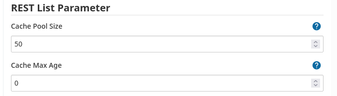

[#valueOrder]
=== Optional Value Ordering

NOTE: Added in v1.2.0

This option in the "Advanced" section of the parameter configuration allows the user to apply a sort order on the values received from the endpoint specified.
The default value of this option is `NONE`, so no additional sporting gets applied on the values received.
The other two options offer tha ability to apply either an ascending or descending sort order to the received values.

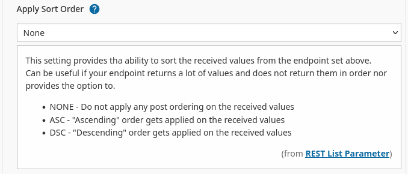

[#pipeline-parameter]
=== Definition in Pipeline

[source,groovy]
----
pipeline {
  agent any
  parameters {
    RESTList(
      name: 'REST_VALUE',
      description: '',
      restEndpoint: 'http://test.lan',
      credentialId: '',
      mimeType: 'APPLICATION_JSON',
      valueExpression: '$.*',
      cacheTime: 10,    // optional
      defaultValue: '', // optional
      filter: '.*',     // optional
      valueOrder: 'ASC', // optional
      customHeaders: [   // optional
        [name: 'X-API-Key', credentialId: 'example-api-key'],
        [name: 'Authorization', credentialId: 'example-auth-token', valuePrefix: 'CustomFormat ']
      ],
      pagination: linkHeader(maxPages: 5) // optional, see Pagination
    )
  }

  stages {
    stage('Test') {
      steps {
        println env.REST_VALUE
      }
    }
  }
}
----

[#jobdsl-parameter]
=== Definition in JobDsl

[source,groovy]
----
pipelineJob('DemoJob') {
  parameters {
    RESTList {
      name('REST_VALUE')
      description('TEST')
      restEndpoint('http://test.lan')
      credentialId('credID')
      mimeType('APPLICATION_JSON')
      valueExpression('$.*')
      cacheTime(10)       // optional
      defaultValue('')    // optional
      filter('.*')        // optional
      valueOrder('NONE')  // optional
    }
  }
  definition {
    cps {
      script("""
        pipeline {
            agent any

            stages {
                stage('Test') {
                    steps {
                        println env.REST_VALUE
                    }
                }
            }
        }
      """)
      sandbox()
    }
  }
}
----

[#multi-list-parameter]
=== REST Multi List Parameter

The `REST Multi List Parameter` lets the user pick several entries from the same kind of REST response in one build.
It offers the same configuration as the `REST List Parameter` (endpoint, credentials, MIME type, value and display expressions, filter, order, cache and custom headers) and fetches its entries the same way.
The build form shows a searchable multi-select.

Its value is an ordered list of strings.
Entries are kept in the order they are listed in, and duplicates are removed.

==== Definition in Pipeline

The symbols are `RESTMultiList`, `RestMultiList` and `RESTMultiListParam`.
They take the same properties as `RESTList`.

[source,groovy]
----
pipeline {
  agent any
  parameters {
    RESTMultiList(
      name: 'TARGETS',
      description: 'Where to deploy',
      restEndpoint: 'https://inventory.example.com/api/targets',
      credentialId: '',
      mimeType: 'APPLICATION_JSON',
      valueExpression: '$.*.name',
      defaultValue: '["staging"]', // optional, see below
      allowEmptyValue: false,      // optional
      enableValidation: true       // optional
    )
  }

  stages {
    stage('Deploy') {
      steps {
        script {
          params.TARGETS.each { target ->
            echo "Deploying to ${target}"
          }
        }
      }
    }
  }
}
----

In Pipeline, `params.TARGETS` is a `List` of strings.
The same list can be used for fan-out, e.g. `+parallel params.TARGETS.collectEntries { t -> [(t): { echo "deploy ${t}" }] }+`.

In Job DSL the parameter is declared as `+RESTMultiList { ... }+`, with the same properties as `RESTList`.

==== Environment variable

The environment variable (and its upper-cased alias) holds the list as a compact JSON array of JSON strings, for example `["staging","prod"]`.
An empty list is `[]`.
Every element is written as a JSON string, even when its text is JSON itself: an element `{"name":"v1"}` becomes `["{\"name\":\"v1\"}"]`.

In a shell step, iterate over the elements with `jq`:

[source,shell]
----
echo "$TARGETS" | jq -r '.[]' | while read -r target; do
  echo "Deploying to $target"
done
----

==== Passing the value as a string

The CLI, the remote API, the Pipeline `build` step with a `string` parameter and re-runs pass the value as one string.
It is read as follows:

* A JSON array whose elements are all JSON strings becomes that list: `["a","c"]` is `a`, `c`.
* The empty string and `[]` are the empty list.
* Any other string is a list with that one string: `a` is `a`, and `a,c` is the single element `a,c`.

Strings are never split on commas or any other delimiter.

A single element that is itself a JSON array of strings must be wrapped in an array: `["[\"x\"]"]` is the single element `["x"]`.

[source,groovy]
----
build job: 'deploy', parameters: [string(name: 'TARGETS', value: '["staging","prod"]')]
----

On the remote API, pass the list as one URL-encoded JSON array:

[source,shell]
----
curl -X POST "$JENKINS_URL/job/deploy/buildWithParameters" \
  --user "$USER:$TOKEN" \
  --data-urlencode 'TARGETS=["staging","prod"]'
----

Repeating the parameter name (`?TARGETS=staging&TARGETS=prod`) is not supported: Jenkins rejects the request and no build starts.

==== Validation and free-form entries

With `Enable Value Validation` checked (the default), every element must be the value of an entry.
The list is accepted from the link:#valueCaching[cached values] when they are fresh and contain every element; otherwise the entries are fetched once when the build is submitted and every element is checked against them.
If that fetch fails, any non-empty list is rejected.

With it unchecked, the user can also add entries that are not in the list: typing into the multi-select offers the typed text as `Use "<text>"`, and picking it adds the text verbatim as its own element.
The endpoint is then not contacted to validate the submission, which helps while it is unavailable and for values it does not (yet) return.

An empty list is accepted only when `Allow Empty Value` is checked.
Empty elements are always rejected.
A rejected value stops the build with `Illegal value for parameter <name>: <detail>`, where the detail is the first offending element, `""` for an empty element, or `[]` for a disallowed empty list.

==== Default value

The default value refers to entries by their display value and is read with the same string rule: `["Alpha","Gamma"]` preselects two entries, and `Beta` preselects one.
Default values that match no entry are ignored when validation is enabled; when it is disabled, they are preselected as custom entries.
When a build is re-run, the previous selection becomes the new form's default.

==== Known plugin interactions

The value of this parameter is a list, not a string.
Plugins that assume a parameter value is a string may therefore handle it differently than a `REST List Parameter`:

* Parameterized Trigger's "Current build parameters" copies the parameter value object unchanged, so the list is expected to reach the triggered build as is.
* Rebuilder (checked with version 332): "Rebuild" opens the multi-select with the previous selection preselected, and the rebuilt build receives the same list.

[#jcasc]
=== Set Global Options via JCasC

[source,yaml]
----
unclassified:
  # ...
  restListParam:
    cacheSize: 50    # in mebibyte, needs to be greater than 0
    cacheTime: 0     # in minutes, 0 => per default don't use cache
    fetchTimeout: 60 # in seconds, bounds one fetch of a parameter's values including all pages
  # ...
----

[#contributing]
== Contributing

I welcome all contributions and pull requests!
If you have a larger feature in mind please open an issue, so we can discuss the implementation before you start.

NOTE: I prefer GitHub Issues over Jira Issues, but I check both regularly.

For further contributing info please have a look at the JenkinsCI link:https://github.com/jenkinsci/.github/blob/master/CONTRIBUTING.md[contribution guidelines].

[#licence]
== Licence

image::https://www.gnu.org/graphics/gplv3-or-later.svg[link="https://opensource.org/licenses/GPL-3.0"]

Just if the badge from `shields.io` and the link:LICENSE[] file do not make it obvious enough, this project is licenced under the link:https://opensource.org/licenses/GPL-3.0[GPLv3] or later.

[#bundled-project-sources]
== Bundled Project Sources

NOTE: The vendored Select2-Bootstrap4-Theme was removed; the dropdowns are styled with the plugin's own Select2 theme, built on the Jenkins design tokens.

No third-party sources are bundled with this plugin.

[#development]
== Development

=== Requirements

* Java 8 or newer
* Maven 3 or newer
* (optional) a test Jenkins instance to deploy the plugin SNAPSHOT to for testing

=== Build

[source,shell script]
----
$ # build, test and package to hpi (hpi can be deployed to test Jenkins)
$ mvn -B package --file pom.xml
----

[source,shell script]
----
$ # build, test, package and launch test Jenkins
$ mvn -B hpi:run --file pom.xml
----

=== Release a new Version

NOTE: This Plugin uses link:https://semver.org/spec/v2.0.0.html[SemVer] to version its releases

To creat a new release follow the instruction found for the link:https://github.com/jenkinsci/incrementals-tools[Incremental tools] to create a release whilst incrementing the correct position of the SemVer.
