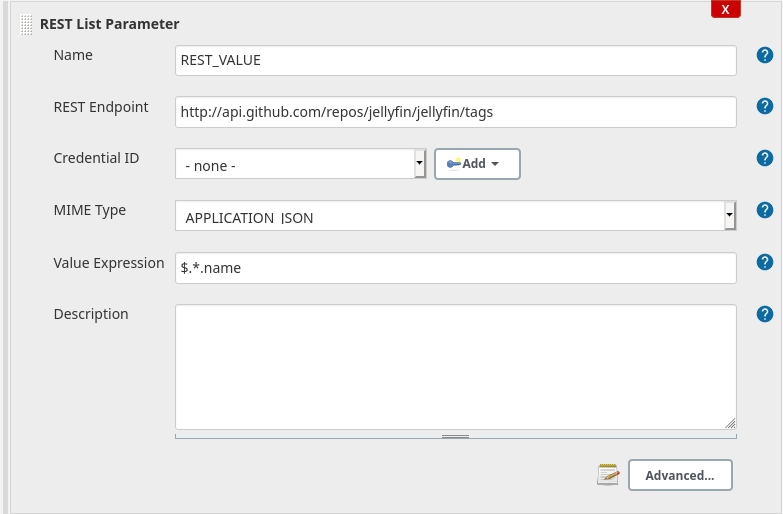
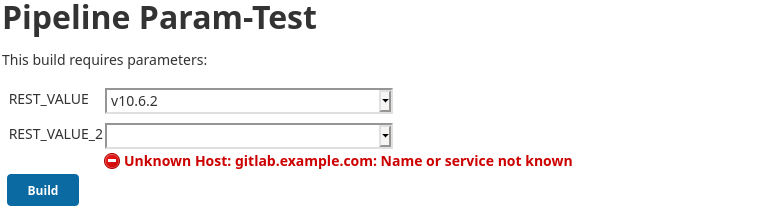

[[rest-list-parameter-plugin]]
= REST-List Parameter Plugin
:toc: macro
:toc-title:

image:https://ci.jenkins.io/job/Plugins/job/rest-list-parameter-plugin/job/main/1/badge/icon[link="https://ci.jenkins.io/job/Plugins/job/rest-list-parameter-plugin/job/main/"]
image:https://img.shields.io/github/license/jenkinsci/rest-list-parameter-plugin.svg?color=green[link="https://github.com/jenkinsci/rest-list-parameter-plugin/blob/main/LICENSE"]
image:https://img.shields.io/maintenance/yes/2020.svg[link="https://github.com/jenkinsci/rest-list-parameter-plugin"]
image:https://img.shields.io/github/contributors/jenkinsci/rest-list-parameter-plugin.svg?color=blue[link="https://github.com/jenkinsci/rest-list-parameter-plugin/graphs/contributors"]
image:https://img.shields.io/jenkins/plugin/i/rest-list-parameter.svg?color=blue&label=installations[link="https://plugins.jenkins.io/rest-list-parameter"]
image:https://img.shields.io/github/release/jenkinsci/rest-list-parameter-plugin.svg?label=changelog[link="https://github.com/jenkinsci/rest-list-parameter-plugin/releases/latest"]

[#introduction]
== Introduction

This Plugin provides parameter type that can request a REST endpoint and offer a list of values parsed from the response value at build start time.
The REST responses may contain Json or XML, which can be parsed with link:https://restfulapi.net/json-jsonpath/[Json-Path] and link:https://www.w3schools.com/xml/xpath_syntax.asp[xPath] respectively.
If the REST endpoint requires authentication, then either Basic or Bearer authentication can be used.

toc::[]

[#changelog]
== Changelog

Release notes can be found in the link:https://github.com/jenkinsci/rest-list-parameter-plugin/releases[GitHub Releases]

[#features]
== Features

* Specify any REST/Web endpoint that returns either a Json or XML response with values to select from for a build
* Authenticate against the endpoint if required (either with `BASIC` or `BEARER` authentication)
* Filter/Pars the values of the web response with Json-Path or xPath (depending on MIME type)
* Filter the already filtered/parsed values via a REGEX
* Set the per default preselected value
* User-friendly error communication

[#configuration]
== Configuration

[#jsonPath-configuration]
=== Json-Path configuration

image::.media/json-path.png[Demo config for Json-Path]

If you expect the response of the specified endpoint to produce a Json response and need to utilize Json-Path, then you have to set the MIME type to _APPLICATION_JSON_ (this will also send this MIME as `ACCEPT` header) and provide the desired Json-Path in the _Value Expression_ field.

The result of such a configuration will be the application of the Json-Path on the response Json to pars the string values later provided in the _Build with Parameter_ dropdown of this parameter.

[#xPath-configuration]
=== xPath configuration

image::.media/xPath.png[Demo config for xPath]

If you expect the response of the specified endpoint to produce an XML response and need to utilize xPath, then you have to set the MIME type to _APPLICATION_XML_ (this will also send this MIME as `ACCEPT` header) and provide the desired xPath in the _Value Expression_ field.

The result of such a configuration will be the application of the xPath on the response XML to pars the string values later provided in the _Build with Parameter_ dropdown of this parameter.

[#auth-configuration]
=== Authentication configuration

Depending on the authentication requirement for the REST/Web endpoint there are three supported methods:

* `NONE` if there is no authentication requirement simply don't select any _Credential ID_
* `BASIC` if this authentication type is required, then simply select any Username and Password credential in the _Credential ID_ field
* `BEARER` if this authentication type is required, then simply select any Secret Text credential in the _Credential ID_ field

NOTE: The Authentication header will be build and added based on the type of the selected credential type.

[#pipeline-parameter]
=== Definition in Pipeline

[source,goovy]
----
pipeline {
  agent any
  parameters {
    RESTList(
      name: 'REST_VALUE',
      description: '',
      restEndpoint: 'http://test.lan',
      credentialId: '',
      mimeType: 'APPLICATION_JSON',
      valueExpression: '$.*',
      defaultValue: '', // optional
      filter: '.*' // optional
    )
  }

  stages {
    stage('Test') {
      steps {
        println env.REST_VALUE
      }
    }
  }
}
----

[#jobdsl-parameter]
=== Definition in JobDsl

[source,goovy]
----
pipelineJob('DemoJob') {
  parameters {
    RESTList {
      name('REST_VALUE')
      description('TEST')
      restEndpoint('http://test.lan')
      credentialId('credID')
      mimeType('APPLICATION_JSON')
      valueExpression('$.*')
      defaultValue('') // optional
      filter('.*') // optional
    }
  }
  definition {
    cps {
      script("""
        pipeline {
            agent any

            stages {
                stage('Test') {
                    steps {
                        println env.REST_VALUE
                    }
                }
            }
        }
      """)
      sandbox()
    }
  }
}
----

[#contributing]
== Contributing

I welcome all contributions and pull requests!
If you have a larger feature in mind please open an issue, so we can discuss the implementation before you start.

NOTE: I prefer GitHub Issues over Jira Issues, but I check both regularly.

For further contributing info please have a look at the JenkinsCI link:https://github.com/jenkinsci/.github/blob/master/CONTRIBUTING.md[contribution guidelines].

[#development]
== Development

=== Requirements

* Java 8 or newer
* Maven 3 or newer
* (optional) a test Jenkins instance to deploy the plugin SNAPSHOT to for testing

=== Build

[source,shell script]
----
$ # build, test and package to hpi (hpi can be deployed to test Jenkins)
$ mvn -B package --file pom.xml
----

[source,shell script]
----
$ # build, test, package and launch test Jenkins
$ mvn -B hpi:run --file pom.xml
----

=== Release a new Version

NOTE: This Plugin uses link:https://semver.org/spec/v2.0.0.html[SemVer] to version its releases

To creat a new release follow the instruction found for the link:https://github.com/jenkinsci/incrementals-tools[Incremental tools] to create a release whilst incrementing the correct position of the SemVer.
