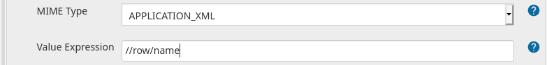

[[rest-list-parameter]]
= REST-List Parameter Plugin
:toc: macro
:toc-title:

image:https://ci.jenkins.io/job/Plugins/job/rest-list-parameter-plugin/job/main/badge/icon[link="https://ci.jenkins.io/job/Plugins/job/rest-list-parameter-plugin/job/main/"]
image:https://img.shields.io/codefactor/grade/github/jenkinsci/rest-list-parameter-plugin/main.svg[CodeFactor Grade,link="https://www.codefactor.io/repository/github/jenkinsci/rest-list-parameter-plugin"]
image:https://img.shields.io/github/license/jenkinsci/rest-list-parameter-plugin.svg?color=green[link="https://github.com/jenkinsci/rest-list-parameter-plugin/blob/main/LICENSE"]
image:https://img.shields.io/maintenance/yes/2021.svg[link="https://github.com/jenkinsci/rest-list-parameter-plugin"] +
image:https://img.shields.io/github/contributors/jenkinsci/rest-list-parameter-plugin.svg?color=blue[link="https://github.com/jenkinsci/rest-list-parameter-plugin/graphs/contributors"]
image:https://img.shields.io/jenkins/plugin/i/rest-list-parameter.svg?color=blue&label=installations[link="https://plugins.jenkins.io/rest-list-parameter"]
image:https://img.shields.io/github/release/jenkinsci/rest-list-parameter-plugin.svg?label=changelog[link="https://github.com/jenkinsci/rest-list-parameter-plugin/releases/latest"]

[#introduction]
== Introduction

This Plugin provides parameter type that can request a REST endpoint and offer a list of values parsed from the response value at build start time.
The REST responses may contain Json or XML, which can be parsed with link:https://restfulapi.net/json-jsonpath/[Json-Path] and link:https://www.w3schools.com/xml/xpath_syntax.asp[xPath] respectively.
If the REST endpoint requires authentication, then either Basic or Bearer authentication can be used.

toc::[]

[#changelog]
== Changelog

Release notes can be found in the link:https://github.com/jenkinsci/rest-list-parameter-plugin/releases[GitHub Releases]

[#features]
== Features

* Specify any REST/Web endpoint that returns either a Json or XML response with values to select from for a build
* Authenticate against the endpoint if required (either with `BASIC` or `BEARER` authentication)
* Filter/Pars the values of the web response with Json-Path or xPath (depending on MIME type)
* Set a per-selected default value (as long as that value is within the received value list)
* User-friendly error communication
* Response value caching
* Advanced configuration validation
* Optional value post processing
** Filter the already parsed values via a REGEX
** Apply a sort order to the values

[#configuration]
== Configuration

image::.media/parameter.png[Parameter configuration (Advanced collapsed)]

image::.media/parameter-full.png[Parameter configuration (Advanced expanded)]

image::.media/build.png[Demo Build (+ showcasing error messaging)]

[#jsonPath-configuration]
=== Json-Path configuration

image::.media/json-path.png[Demo config for Json-Path]

If you expect the response of the specified endpoint to produce a Json response and need to utilize Json-Path, then you have to set the MIME type to _APPLICATION_JSON_ (this will also send this MIME as `ACCEPT` header) and provide the desired Json-Path in the _Value Expression_ field.

The result of such a configuration will be the application of the Json-Path on the response Json to pars the string values later provided in the _Build with Parameter_ dropdown of this parameter.

[#xPath-configuration]
=== xPath configuration

If you expect the response of the specified endpoint to produce an XML response and need to utilize xPath, then you have to set the MIME type to _APPLICATION_XML_ (this will also send this MIME as `ACCEPT` header) and provide the desired xPath in the _Value Expression_ field.

The result of such a configuration will be the application of the xPath on the response XML to pars the string values later provided in the _Build with Parameter_ dropdown of this parameter.

[#auth-configuration]
=== Authentication configuration

Depending on the authentication requirement for the REST/Web endpoint there are three supported methods:

* `NONE` if there is no authentication requirement simply don't select any _Credential ID_
* `BASIC` if this authentication type is required, then simply select any Username and Password credential in the _Credential ID_ field
* `BEARER` if this authentication type is required, then simply select any Secret Text credential in the _Credential ID_ field

IMPORTANT: The Authentication header will be build and added based on the type of the selected credential type.

[#validation]
=== Parameter Config Validation

NOTE: Added in v1.1.0

The configuration page of this plugin features supportive form validation (which was already present in a basic form in v1.0.x).
With v1.1.x+ the validation got expanded to be more helpful and prevent the constant switch from the configuration to a build and back, just to validate the configuration.
The most notable expansion in validation was the `REST Endpoint` field validation, which now works similar to the validation found for the SCM fields (Endpoint and credential).
Additionally, a `Test Configuration` button got added, which once pressed, attempts to query the endpoint and list the number of parsed values as well as the first value in the list.

image::.media/config-valid.png[Successful Configuiration Validation]

image::.media/config-invalid.png[Faild Configuiration Validation]

[#valueCaching]
=== Value Caching

NOTE: Added in v1.2.0

The ability to use value caching allows for great performance improvements in cases of repetitive building and querying the same REST endpoints.
Additionally, it drastically decreases the amount of endpoint queries, which is especially useful for rate limited endpoints.
Per default caching is disabled for new and old `REST List Parameter`, but can be activated at any time by setting how many minutes the values should stay cached for.

Additionally, there are global configuration values now, that give the user control over the global cache size _(default 50 MiB)_, as well as the default value for the cache max age _(default 0 minutes)_.
These values can be overwritten within the UI or via the link:https://github.com/jenkinsci/configuration-as-code-plugin[ConfigurationAsCode] plugin and applying a config link:#jcasc[with this] added.

image::.media/global-config.png[Global Config]

[#valueOrder]
=== Optional Value Ordering

NOTE: Added in v1.2.0

This option in the "Advanced" section of the parameter configuration allows the user to apply a sort order on the values received from the endpoint specified.
The default value of this option is `NONE`, so no additional sporting gets applied on the values received.
The other two options offer tha ability to apply either an ascending or descending sort order to the received values.

image::.media/valueOrder.png["AdvancedOption" Apply Sort Order]

[#pipeline-parameter]
=== Definition in Pipeline

[source,groovy]
----
pipeline {
  agent any
  parameters {
    RESTList(
      name: 'REST_VALUE',
      description: '',
      restEndpoint: 'http://test.lan',
      credentialId: '',
      mimeType: 'APPLICATION_JSON',
      valueExpression: '$.*',
      cacheTime: 10,    // optional
      defaultValue: '', // optional
      filter: '.*',     // optional
      valueOrder: 'ASC' // optional
    )
  }

  stages {
    stage('Test') {
      steps {
        println env.REST_VALUE
      }
    }
  }
}
----

[#jobdsl-parameter]
=== Definition in JobDsl

[source,groovy]
----
pipelineJob('DemoJob') {
  parameters {
    RESTList {
      name('REST_VALUE')
      description('TEST')
      restEndpoint('http://test.lan')
      credentialId('credID')
      mimeType('APPLICATION_JSON')
      valueExpression('$.*')
      cacheTime(10)       // optional
      defaultValue('')    // optional
      filter('.*')        // optional
      valueOrder('NONE')  // optional
    }
  }
  definition {
    cps {
      script("""
        pipeline {
            agent any

            stages {
                stage('Test') {
                    steps {
                        println env.REST_VALUE
                    }
                }
            }
        }
      """)
      sandbox()
    }
  }
}
----

[#jcasc]
=== Set Global Options via JCasC

[source,yaml]
----
unclassified:
  # ...
  restListParam:
    cacheSize: 50 # in mebibyte, needs to be greater than 0
    cacheTime: 0  # in minutes, 0 => per default don't use cache
  # ...
----

[#contributing]
== Contributing

I welcome all contributions and pull requests!
If you have a larger feature in mind please open an issue, so we can discuss the implementation before you start.

NOTE: I prefer GitHub Issues over Jira Issues, but I check both regularly.

For further contributing info please have a look at the JenkinsCI link:https://github.com/jenkinsci/.github/blob/master/CONTRIBUTING.md[contribution guidelines].

[#licence]
== Licence

image::https://www.gnu.org/graphics/gplv3-or-later.svg[link="https://opensource.org/licenses/GPL-3.0"]

Just if the badge from `shields.io` and the link:LICENSE[] file do not make it obvious enough, this project is licenced under the link:https://opensource.org/licenses/GPL-3.0[GPLv3] or later.

[#bundled-project-sources]
== Bundled Project Sources

NOTE: Bundled as of v1.3.0

[cols="1,^0,^0,2"]
|===
|Project |Version |Licence |Description

|[.line-through]#link:https://github.com/select2/select2[Select2]#
|[.line-through]#`v4.0.13`#
|[.line-through]#link:https://github.com/select2/select2/blob/4.0.13/LICENSE.md[MIT]#
|[.line-through]#An amazingly simple to use jQuery replacement for select boxes (used to offer a filterable select dropdown)#
Replaced with the link:https://github.com/jenkinsci/select2-api-plugin[Select2 Api Plugin] in 1.4.x

|link:https://github.com/ttskch/select2-bootstrap4-theme[Select2-Bootstrap4-Theme]
|`v1.5.2`
|link:https://github.com/ttskch/select2-bootstrap4-theme/blob/1.5.2/LICENSE[MIT]
|A CSS theme for Select2, when used in Bootstrap4 apps
|===

[#development]
== Development

=== Requirements

* Java 8 or newer
* Maven 3 or newer
* (optional) a test Jenkins instance to deploy the plugin SNAPSHOT to for testing

=== Build

[source,shell script]
----
$ # build, test and package to hpi (hpi can be deployed to test Jenkins)
$ mvn -B package --file pom.xml
----

[source,shell script]
----
$ # build, test, package and launch test Jenkins
$ mvn -B hpi:run --file pom.xml
----

=== Release a new Version

NOTE: This Plugin uses link:https://semver.org/spec/v2.0.0.html[SemVer] to version its releases

To creat a new release follow the instruction found for the link:https://github.com/jenkinsci/incrementals-tools[Incremental tools] to create a release whilst incrementing the correct position of the SemVer.
